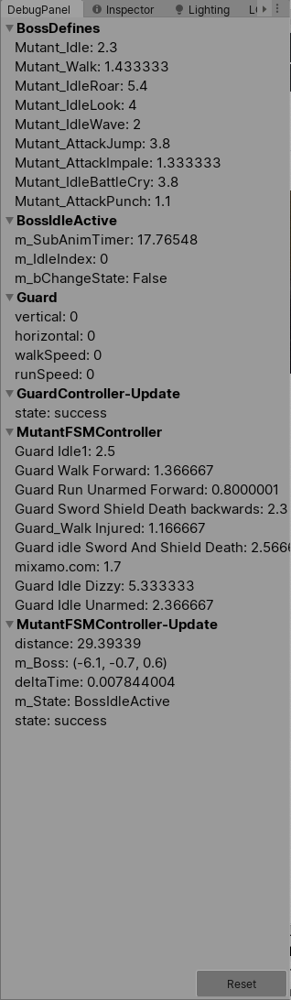

# Unity Debug Panel v1.0

Simple Unity debug panel, for view variables realtime.

  - Lean code
  - Easy to add a variable to the panel
  - Real time updates

### Display

### Usage

using TM.Utils;

debugLog.instance.Log("Nitro", "fuel", mFuel);

### Installation

* copy it into your assets directory.

### Change Log
* v1.0 first commit

